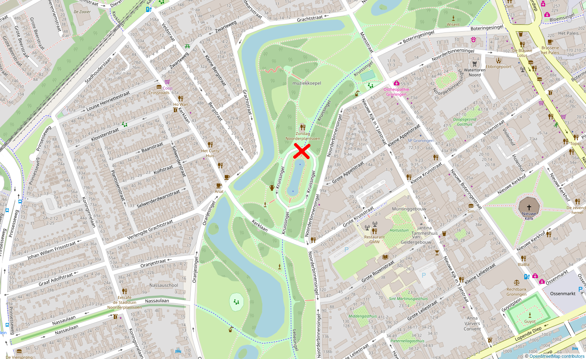
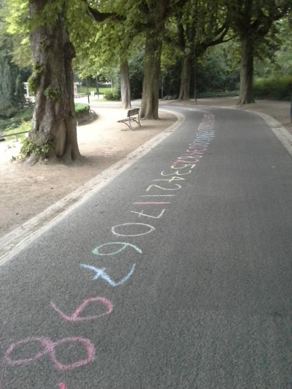

# Pi Approximation Day 2018

Pi Approximation Day 2018

Since 2012, I celebrate Pi Approximation Day by approximating pi with streetchalk at the Noorderplantsoen Groningen.

 * What: Approximate pi with street chalk
 * When: 5:46 AM (yes, in the morning) at Juli 22nd 2018
 * Where: Noorderplantsoen, Groningen, at the North side of the oval pond with sprinklers, close to restaurant Zondag (see map below)
 * To bring: a box of street chalk, knee protectors are recommended
 * Costs: a box of street chalk :-)

If it is raining, at 4:00 AM, the event will be cancelled.

Event will take place: YES. 





## FAQ

### How to listen to the digits of pi?

```
cat pi.txt | espeak -s 10 -g 10
```