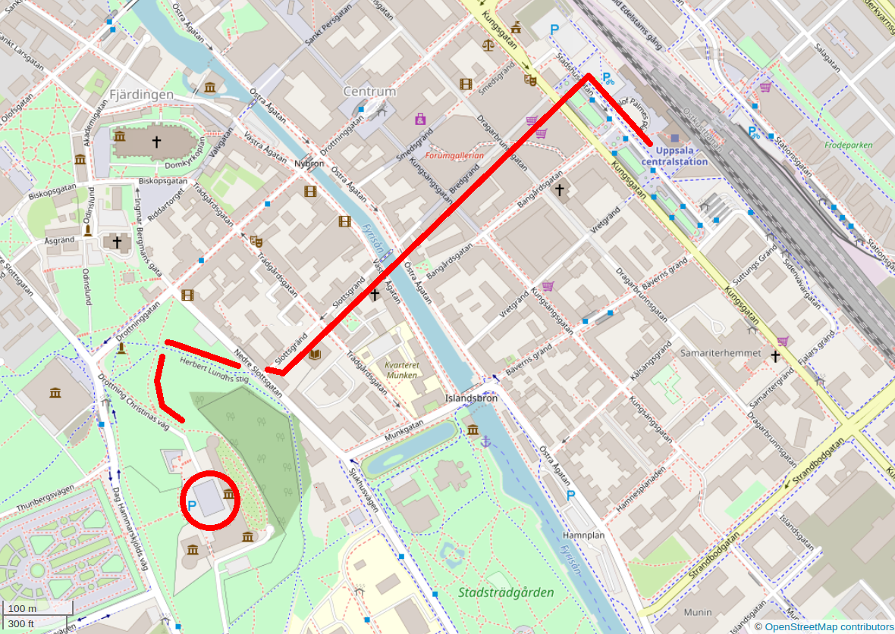

# Pi Approximation Day

 * What: Approximate pi with street chalk  (similar to [Pi Day](https://bit.ly/pi_day_uppsala))
 * When: Pi Approximation Day (that is, July 22nd) from 7:22 AM, then approximately one hour
 * Where: [Uppsala Slott, Uppsala](https://www.openstreetmap.org/search?query=uppsala%20slott#map=18/59.85363/17.63520),
   which is a 10 minutes walk from the central station (see map below)
 * To bring: a box of street chalk, knee protectors are recommended
 * Costs: a box of street chalk :-)

> How to get to the Slott

